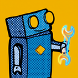

<p align="center">
  <br />
  <strong>Sepp's Workshop</strong><br />
  Design System
</p>
<p align="center">
  
  
</p>

Sepp is the robot who keeps things running at [sepp.med](https://www.seppmed.com). This is his workshop: one colour theme for the tools developers stare at all day, built on the company's dark blue.

This repository is the foundation, not a theme you can install. It holds the colours, the rules for using them, and a build that refuses to pass if any text drops below WCAG AA. The themes themselves live in their own repositories and read everything from here.

## Contents

- [Ports](#ports)
- [The theme at a glance](#the-theme-at-a-glance)
- [Palette](#palette)
- [Surfaces, text, borders](#surfaces-text-borders)
- [Syntax](#syntax)
- [Semantic roles](#semantic-roles)
- [ANSI](#ansi)
- [Overlays](#overlays)
- [Shell and prompt roles](#shell-and-prompt-roles)
- [Typography](#typography)
- [Build gates](#build-gates)
- [Build flow and files](#build-flow-and-files)
- [For ports](#for-ports)
- [Assets](#assets)
- [Want to join Sepp's Workshop?](#want-to-join-sepps-workshop)

## Ports

| Target           | Repository                        | Status  |
| ---------------- | --------------------------------- | ------- |
| VS Code          | `sepps-workshop-vs-code`          | planned |
| Windows Terminal | `sepps-workshop-windows-terminal` | planned |
| PowerShell       | `sepps-workshop-powershell`       | planned |
| fish             | `sepps-workshop-fish`             | planned |
| Starship         | `sepps-workshop-starship`         | planned |

One theme per port. There are no variants.

## The theme at a glance

A medium-dark theme. The canvas is sepp.med Darkblue, the accent is Sunset yellow, and code is coloured with three brand hues (yellow, orange, cyan-blue) at two lightness steps each. Every colour is a brand colour, one of its official tints, or one of three documented derived values.

The preview pages are generated from the tokens. Clone the repository and open them in a browser:

- [`preview/01-syntax.html`](preview/01-syntax.html): code samples and editor states
- [`preview/02-terminal.html`](preview/02-terminal.html): the sixteen ANSI colours
- [`preview/03-shell.html`](preview/03-shell.html): shell and prompt roles
- [`preview/04-contrast.html`](preview/04-contrast.html): every text pair the build checks, with its contrast

## Palette

The base colours come from the sepp.med brand kit.

<!-- tokens:palette -->

| Colour       | Hex       | On Darkblue | Ladder       |
| ------------ | --------- | ----------- | ------------ |
| Darkblue     | `#0d3174` | 1.00:1      | 100 % … 10 % |
| Sunset       | `#fbba00` | 7.10:1      | 100 % … 10 % |
| Shadowgrey   | `#b2b2b2` | 5.80:1      | 100 % … 10 % |
| Middleblue   | `#0069a9` | 2.10:1      | 100 % … 10 % |
| Pumpelorange | `#ec6608` | 3.79:1      | 100 % … 10 % |
| Windblue     | `#0093d3` | 3.58:1      | 100 % … 10 % |
| Lightorange  | `#f59e33` | 5.75:1      | 100 % … 10 % |
| Darkblack    | `#1b1d1c` | 1.38:1      | 100 % … 10 % |
| Signalred    | `#cd1719` | 2.18:1      | none         |
| Freegreen    | `#3aaa35` | 4.09:1      | 100 % … 10 % |
| White        | `#ffffff` | 12.29:1     | none         |

<!-- /tokens -->

**Ladders.** Every colour except Signalred and White has a ladder of tints in 10 % steps towards white, as in the brand kit. The build generates them (`palette.<name>.<step>`), so `pumpelorange.70` is 70 % Pumpelorange and 30 % white.

**Brand rules the foundation follows:**

- Signalred has no tints. Mixed with white it drifts into pink.
- Signalred and Freegreen are signals (error, success, removed, added). They carry no syntax slot.
- White is part of the brand without being listed in it. Here it is used only as text on the Signalred fill.

### Two departures from the ladder

Everything else resolves to a base colour or a ladder step. The exceptions live under `derived` in `tokens.json5`, with the reason beside each.

**Surfaces below the canvas.** The ladder only goes lighter. `derived.bg_sunk` is Darkblue mixed 80 % with Darkblack: `#102d62`. The build verifies the recipe.

**A readable red.** Signalred reaches 2.18:1 on Darkblue. That is under the 3:1 a squiggle needs and far under the 4.5:1 text needs, and red text cannot be avoided: ANSI red, `git diff` removals, shell error highlighting. `derived.signalred_on_dark` (`#ff897b`, 5.34:1) keeps Signalred's hue in OKLCH, raises the lightness and holds the chroma at the sRGB maximum, which gives a warm coral red and not the pink of a white tint. `derived.signalred_on_dark_bright` (`#ffb4aa`, 7.23:1) is the next step of the same hue, for ANSI bright red. The build checks that both stay on the Signalred hue.

The rule for ports: **red as text is `semantic.danger`; red as a fill is Signalred** with white text on it (5.63:1).

## Surfaces, text, borders

<!-- tokens:surfaces -->

| Token                 | Source            | Value     | On `bg`          | Use                                              |
| --------------------- | ----------------- | --------- | ---------------- | ------------------------------------------------ |
| `surface.bg`          | `darkblue`        | `#0d3174` |                  | Editor canvas                                    |
| `surface.bg_sunk`     | `derived.bg_sunk` | `#102d62` |                  | Sidebar, activity bar, status bar, inactive tabs |
| `surface.bg_soft`     | `darkblue.90`     | `#254682` |                  | Hover, inputs                                    |
| `surface.bg_overlay`  | `derived.bg_sunk` | `#102d62` |                  | Menus, hover and suggest widgets, quick input    |
| `surface.bg_terminal` | `darkblue`        | `#0d3174` |                  | Terminal background                              |
| `text.fg`             | `darkblue.10`     | `#e7eaf1` | 10.21:1          | Body text, variables                             |
| `text.fg_muted`       | `darkblue.30`     | `#b6c1d5` | 6.78:1           | Secondary text, punctuation                      |
| `text.fg_subtle`      | `darkblue.40`     | `#9eadc7` | 5.42:1           | Comments, autosuggestions                        |
| `text.fg_disabled`    | `darkblue.60`     | `#6e83ac` | 3.22:1           | Disabled; exempt from the text gate              |
| `border.subtle`       | `darkblue.90`     | `#254682` | 1.33:1           | Dividers                                         |
| `border.default`      | `darkblue.80`     | `#3d5a90` | 1.79:1           | Panel edges                                      |
| `border.control`      | `darkblue.50`     | `#8698ba` | 4.22:1           | Control outline                                  |
| `accent`              | `sunset`          | `#fbba00` | 7.10:1           | Cursor, focus ring, active tab, primary button   |
| `accent_on`           | `darkblue`        | `#0d3174` | 7.10:1 on accent | Text on the accent                               |
| `accent_hover`        | `sunset.80`       | `#fcc833` | 7.87:1           | Primary button under the pointer                 |

<!-- /tokens -->

- `bg_soft` is lighter than the canvas and costs contrast. It carries `fg` and `fg_muted` only, never comments or syntax colours.
- Floating widgets sit on the darker `bg_sunk`. Hover and peek widgets show code, and a darker surface adds contrast.
- `bg_terminal` equals `bg` on purpose. A standalone terminal shows no other surface, and it should be the Darkblue people recognise.
- Body text is not pure white, and no surface is pure black.

## Syntax

A traditional theme uses seven to nine hues. The brand offers three that stay apart on Darkblue. Measured in OKLab, Lightorange sits 4 units from the Pumpelorange tints and the Middleblue tints sit 4 units from the Windblue tints, which is too close to tell apart at a glance, so neither carries a syntax slot. The theme makes up for the missing hues with lightness, the dimension the eye separates best: each hue appears at two steps, and italics add a third axis. Warm colours mark data, cool colours mark behaviour.

### Core slots

<!-- tokens:syntax -->

| Slot        | Source            | Value     | Style  | On `bg` |
| ----------- | ----------------- | --------- | ------ | ------- |
| `comment`   | `text.fg_subtle`  | `#9eadc7` | italic | 5.42:1  |
| `keyword`   | `sunset`          | `#fbba00` |        | 7.10:1  |
| `string`    | `pumpelorange.40` | `#f7c29c` |        | 7.70:1  |
| `number`    | `pumpelorange.70` | `#f29452` |        | 5.35:1  |
| `function`  | `windblue.60`     | `#66bee5` |        | 5.89:1  |
| `parameter` | `windblue.30`     | `#b3dff2` | italic | 8.63:1  |
| `type`      | `sunset.40`       | `#fde399` |        | 9.73:1  |
| `constant`  | `pumpelorange.70` | `#f29452` |        | 5.35:1  |
| `tag`       | `sunset`          | `#fbba00` |        | 7.10:1  |
| `attr`      | `windblue.30`     | `#b3dff2` | italic | 8.63:1  |
| `regex`     | `pumpelorange.70` | `#f29452` |        | 5.35:1  |
| `punct`     | `text.fg_muted`   | `#b6c1d5` |        | 6.78:1  |

<!-- /tokens -->

Slots that share a colour on purpose are listed in `syntax_tokens.aliases`: `number`, `constant` and `regex`; `keyword` and `tag`; `parameter` and `attr`.

Variables and properties are `fg`. In JavaScript and TypeScript nearly every declaration is a `const`, so `variable.other.constant` falls through to `fg`; the language server's `variable.readonly` token marks real constants.

### Extended tokens

Each resolves to a core slot, a text colour or a semantic role, with an optional font style.

<!-- tokens:extended -->

| Token                | Colour            | Style             |
| -------------------- | ----------------- | ----------------- |
| `variable`           | `fg`              |                   |
| `property`           | `fg`              |                   |
| `operator`           | `fg_muted`        |                   |
| `decorator`          | `function`        | italic            |
| `builtin`            | `function`        | italic            |
| `namespace`          | `type`            |                   |
| `macro`              | `function`        |                   |
| `lifetime`           | `constant`        |                   |
| `heading`            | `keyword`         | bold              |
| `link`               | `function`        |                   |
| `selector`           | `tag`             |                   |
| `unit`               | `number`          |                   |
| `hex`                | `string`          |                   |
| `shebang`            | `comment`         |                   |
| `lang_var`           | `keyword`         | italic            |
| `emphasis`           | inherits          | italic            |
| `strong`             | inherits          | bold              |
| `invalid`            | `semantic.danger` | italic, underline |
| `invalid_deprecated` | `fg`              | italic, underline |
| `doc_keyword`        | `keyword`         |                   |
| `doc_type`           | `type`            | italic            |
| `doc_param`          | `parameter`       | italic            |
| `event`              | `function`        |                   |
| `label`              | `fg`              | italic            |

<!-- /tokens -->

`operator` is `fg_muted` and not the keyword colour: Sunset is the loudest hue, and spending it on every `=` would dilute it.

### Recommendation maps

- `scope_recommendations`: TextMate scopes per slot, most specific first. Use them for `tokenColors`. No rule ends in a `meta.*` scope.
- `semantic_token_recommendations`: the standard language-server token types and modifiers. Use them for `semanticTokenColors`, and set `"semanticHighlighting": true`.
- `workbench_color_roles`: which role colours errors, warnings, git states and bracket pairs. Apply the same role wherever the state appears: squiggle, gutter, overview ruler, status bar, file tree.

## Semantic roles

<!-- tokens:semantic -->

| Role      | Foreground on dark                    | On `bg` | Fill                    | Text on fill         |
| --------- | ------------------------------------- | ------- | ----------------------- | -------------------- |
| `danger`  | `derived.signalred_on_dark` `#ff897b` | 5.34:1  | `signalred` `#cd1719`   | `white` (5.63:1)     |
| `success` | `freegreen.50` `#9dd59a`              | 7.27:1  | `freegreen` `#3aaa35`   | `darkblack` (5.63:1) |
| `warning` | `lightorange` `#f59e33`               | 5.75:1  | `lightorange` `#f59e33` | `darkblack` (7.93:1) |
| `info`    | `windblue.60` `#66bee5`               | 5.89:1  | —                       | —                    |

<!-- /tokens -->

- **Warning is Lightorange.** Yellow is the accent, and Pumpelorange is too close to the derived red. Lightorange is the remaining orange; it sits close to the number colour, so ports pair a warning with a shape (a squiggle, an icon), never with colour alone.
- **Danger and success differ in lightness as well as hue**, so the pair survives red-green colour blindness. Success is lighter than contrast alone would require.
- The VS Code debugging status bar uses the danger fill, because the accent is already yellow.

## ANSI

<!-- tokens:ansi -->

| Slot    | Normal                                | On terminal | Bright                                       | On terminal |
| ------- | ------------------------------------- | ----------- | -------------------------------------------- | ----------- |
| black   | `derived.bg_sunk` `#102d62`           | exempt      | `darkblack.40` `#a4a5a4`                     | 4.97:1      |
| red     | `derived.signalred_on_dark` `#ff897b` | 5.34:1      | `derived.signalred_on_dark_bright` `#ffb4aa` | 7.23:1      |
| green   | `freegreen.50` `#9dd59a`              | 7.27:1      | `freegreen.30` `#c4e6c2`                     | 9.04:1      |
| yellow  | `sunset` `#fbba00`                    | 7.10:1      | `sunset.40` `#fde399`                        | 9.73:1      |
| blue    | `middleblue.60` `#66a5cb`             | 4.57:1      | `middleblue.40` `#99c3dd`                    | 6.56:1      |
| magenta | `lightorange` `#f59e33`               | 5.75:1      | `lightorange.60` `#f9c585`                   | 7.82:1      |
| cyan    | `windblue.50` `#80c9e9`               | 6.70:1      | `windblue.30` `#b3dff2`                      | 8.63:1      |
| white   | `shadowgrey.60` `#d1d1d1`             | 8.05:1      | `darkblue.10` `#e7eaf1`                      | 10.21:1     |

<!-- /tokens -->

- **Magenta is Lightorange.** The brand has no magenta. This is the one place where the ANSI name and the colour disagree.
- **Blue and cyan differ in lightness as well as hue.** Blue on a blue terminal is the hardest slot; it takes Middleblue, and cyan takes a lighter Windblue step.
- **The neutrals are true greys** (Shadowgrey and a Darkblack tint). A blue-grey from the Darkblue ladder would not stay apart from blue and cyan.
- `black` is the conventional near-background anchor and is exempt from the contrast gate.

## Overlays

Recipes for the backgrounds that appear behind text and for a few workbench surfaces: `{ color, alpha, border? }`. The build adds two values to each. `hex` is the recipe composited over `surface.bg`, for a port that cannot blend. `hexa` is the recipe itself as `#rrggbbaa`, for a port that can. Over the canvas both look the same.

<!-- tokens:overlay -->

| Recipe                  | Colour         | Alpha | Composited | Border            | Carries          |
| ----------------------- | -------------- | ----- | ---------- | ----------------- | ---------------- |
| `selection`             | `darkblack`    | 60 %  | `#15253f`  |                   | code             |
| `selection_inactive`    | `darkblack`    | 40 %  | `#132951`  |                   | code             |
| `line_highlight`        | `darkblack`    | 30 %  | `#112b5a`  |                   | code             |
| `find_match`            | `pumpelorange` | 15 %  | `#2e3964`  | `pumpelorange.70` | code             |
| `find_match_other`      | `pumpelorange` | 8 %   | `#1f356b`  | `darkblue.50`     | code             |
| `word_highlight`        | `sunset`       | 10 %  | `#253f68`  |                   | code             |
| `word_highlight_strong` | `sunset`       | 10 %  | `#253f68`  | `sunset`          | code             |
| `selected_item`         | `sunset`       | 18 %  | `#384a5f`  |                   | `fg`, `fg_muted` |
| `diff_inserted_line`    | `freegreen`    | 12 %  | `#12406c`  |                   | code             |
| `diff_inserted_text`    | `freegreen`    | 25 %  | `#184f64`  |                   | `fg`, `fg_muted` |
| `diff_removed_line`     | `signalred`    | 14 %  | `#282d67`  |                   | code             |
| `diff_removed_text`     | `signalred`    | 35 %  | `#502854`  |                   | `fg`, `fg_muted` |
| `hover`                 | `darkblack`    | 30 %  | `#112b5a`  |                   | surface          |
| `active`                | `darkblack`    | 50 %  | `#142748`  |                   | surface          |
| `scrim`                 | `darkblack`    | 60 %  | `#15253f`  |                   | non-text         |
| `slider`                | `darkblue.40`  | 30 %  | `#39568d`  |                   | non-text         |
| `slider_hover`          | `darkblue.40`  | 50 %  | `#566f9e`  |                   | non-text         |
| `slider_active`         | `darkblue.40`  | 70 %  | `#7388ae`  |                   | non-text         |
| `merge_current_content` | `windblue`     | 10 %  | `#0c3b7e`  |                   | code             |
| `merge_current_header`  | `windblue`     | 25 %  | `#0a4a8c`  |                   | `fg`, `fg_muted` |
| `stack_frame`           | `lightorange`  | 10 %  | `#243c6e`  |                   | code             |

<!-- /tokens -->

**Overlays darken.** Darkblue is a medium-dark canvas. A selection that lightens it by a visible amount pushes every saturated brand colour below 4.5:1; a selection that darkens it adds contrast. So selection and line highlight mix towards Darkblack.

Highlights that have to carry a hue stay faint and get a border, which also means they do not rely on colour alone. Read and write word highlights share a fill; the write highlight adds the border.

The last column is the overlay's class, and every overlay has exactly one:

- **code** overlays sit behind whole lines on the canvas and are checked against every syntax colour.
- **`fg`, `fg_muted`** overlays sit behind list rows, headers and inline spans and carry those two text colours only.
- **surface** overlays (`hover`, `active`) are also drawn over the sidebar, the status bar and menus. They are checked as code overlays on `bg`, `bg_sunk` and `bg_overlay`, so a port must use `hexa` for them.
- **non-text** overlays are the shadow and the scrollbar thumbs. Nothing is read through them.

The debugger has two frame highlights and the foundation has one recipe, `stack_frame`: a second faint hue would not separate from the first on Darkblue. Ports tell the frames apart by the gutter arrow.

## Shell and prompt roles

fish and PowerShell both need to know what colour a command, an option or an autosuggestion is. `shell_roles` answers that once, and lists the fish variables and PSReadLine keys each role feeds.

<!-- tokens:shell -->

| Role                         | Colour                  | Style     | fish                                                          | PSReadLine                                 |
| ---------------------------- | ----------------------- | --------- | ------------------------------------------------------------- | ------------------------------------------ |
| `command`                    | `function`              |           | `fish_color_command`                                          | `Command`                                  |
| `keyword`                    | `keyword`               |           | `fish_color_keyword`                                          | `Keyword`                                  |
| `option`                     | `attr`                  |           | `fish_color_option`                                           | `Parameter`                                |
| `argument`                   | `fg`                    |           | `fish_color_normal`<br>`fish_color_param`                     | `Default`                                  |
| `string`                     | `string`                |           | `fish_color_quote`                                            | `String`                                   |
| `number`                     | `number`                |           |                                                               | `Number`                                   |
| `variable`                   | `type`                  |           |                                                               | `Variable`                                 |
| `type`                       | `type`                  |           |                                                               | `Type`                                     |
| `member`                     | `fg`                    |           |                                                               | `Member`                                   |
| `operator`                   | `fg_muted`              |           | `fish_color_operator`<br>`fish_color_end`                     | `Operator`                                 |
| `redirection`                | `fg_muted`              |           | `fish_color_redirection`                                      |                                            |
| `escape`                     | `constant`              |           | `fish_color_escape`                                           |                                            |
| `comment`                    | `comment`               | italic    | `fish_color_comment`                                          | `Comment`                                  |
| `autosuggestion`             | `fg_subtle`             |           | `fish_color_autosuggestion`                                   | `InlinePrediction`<br>`ContinuationPrompt` |
| `error`                      | `semantic.danger`       |           | `fish_color_error`<br>`fish_color_status`                     | `Error`                                    |
| `emphasis`                   | `accent`                |           |                                                               | `Emphasis`                                 |
| `valid_path`                 | inherits                | underline | `fish_color_valid_path`                                       |                                            |
| `selection`                  | `overlay.selection`     |           | `fish_color_selection`                                        | `Selection`                                |
| `search_match`               | `overlay.find_match`    |           | `fish_color_search_match`                                     |                                            |
| `pager_selected`             | `overlay.selected_item` |           | `fish_pager_color_selected_background`                        | `ListPredictionSelected`                   |
| `pager_selected_completion`  | `fg`                    |           | `fish_pager_color_selected_completion`                        |                                            |
| `pager_selected_description` | `fg_muted`              |           | `fish_pager_color_selected_description`                       |                                            |
| `pager_selected_prefix`      | `accent`                |           | `fish_pager_color_selected_prefix`                            |                                            |
| `pager_prefix`               | `accent`                |           | `fish_pager_color_prefix`                                     |                                            |
| `pager_completion`           | `fg`                    |           | `fish_pager_color_completion`                                 | `ListPrediction`                           |
| `pager_description`          | `fg_subtle`             |           | `fish_pager_color_description`<br>`fish_pager_color_progress` |                                            |
| `cwd`                        | `accent`                |           | `fish_color_cwd`                                              |                                            |
| `cwd_root`                   | `semantic.danger`       |           | `fish_color_cwd_root`                                         |                                            |
| `user`                       | `function`              |           | `fish_color_user`                                             |                                            |
| `host`                       | `fg_muted`              |           | `fish_color_host`                                             |                                            |
| `host_remote`                | `semantic.warning`      |           | `fish_color_host_remote`                                      |                                            |

<!-- /tokens -->

The selected pager row lightens the canvas, so its text is restated in the `pager_selected_*` roles: the description steps up from `fg_subtle` to `fg_muted`.

Commands take the function colour, not the accent: the cursor is already Sunset, and a typed command is a call.

`prompt_roles` does the same for Starship.

<!-- tokens:prompt -->

| Role                    | Colour             | Style |
| ----------------------- | ------------------ | ----- |
| `directory`             | `accent`           | bold  |
| `git_branch`            | `semantic.info`    |       |
| `character_success`     | `semantic.success` |       |
| `character_error`       | `semantic.danger`  |       |
| `duration`              | `fg_muted`         |       |
| `language_module`       | `fg_muted`         |       |
| `git_status.added`      | `semantic.success` |       |
| `git_status.untracked`  | `semantic.success` |       |
| `git_status.modified`   | `semantic.info`    |       |
| `git_status.renamed`    | `semantic.info`    |       |
| `git_status.deleted`    | `semantic.danger`  |       |
| `git_status.conflicted` | `semantic.warning` |       |
| `git_status.staged`     | `semantic.warning` |       |
| `git_status.ahead`      | `fg_muted`         |       |
| `git_status.behind`     | `fg_muted`         |       |
| `git_status.diverged`   | `fg_muted`         |       |
| `git_status.stashed`    | `fg_muted`         |       |

<!-- /tokens -->

Language modules stay neutral. The brand has too few hues to give each language its own, and a module's symbol already identifies it.

## Typography

Themes cannot ship fonts, and this repository contains none. The foundation recommends:

- **JetBrains Mono** for editors and terminals ([jetbrains.com/lp/mono](https://www.jetbrains.com/lp/mono/), OFL-1.1)
- **JetBrainsMono Nerd Font** where a prompt shows icons, as Starship does ([nerdfonts.com](https://www.nerdfonts.com/font-downloads))

`typography.mono.stack` holds the full fallback stack.

## Build gates

`npm run build` fails when any of these does not hold.

1. **Text contrast.** `fg`, `fg_muted`, `fg_subtle`, every syntax slot and every semantic foreground reach 4.5:1 on `bg`, `bg_sunk` and `bg_overlay`. `fg` and `fg_muted` reach 4.5:1 on `bg_soft`.
2. **Text on overlays.** The same colours reach 4.5:1 on every code overlay. `fg` and `fg_muted` reach 4.5:1 on the label overlays. `hover` and `active` are checked the same way on `bg`, `bg_sunk` and `bg_overlay`.
3. **ANSI.** All sixteen colours except `black` reach 4.5:1 on `bg_terminal`. The same fifteen reach 4.5:1 on `overlay.selection` and `overlay.selection_inactive`, where a terminal draws selected text.
4. **Non-text.** `border.control` and `accent` reach 3:1 on every surface. Every overlay border reaches 3:1 on its own fill. `slider_active` reaches 3:1 on `bg` and `bg_sunk`.
5. **Fills.** The text on each semantic fill, and `accent_on` on `accent` and on `accent_hover`, reach 4.5:1.
6. **Distinctness.** Slots that must not look alike are at least 7 apart in OKLab (×100; about 2 is just noticeable): the listed syntax pairs, every pair within an ANSI row, and each ANSI colour against its bright version. Two core slots may share a colour only if `syntax_tokens.aliases` lists them together.
7. **Signal separation.** `accent`, `warning` and `danger` are at least 7 apart. `danger` and `success` differ by at least 5 in lightness.
8. **Palette integrity.** No hex value outside `palette_base` and `derived`, and no value under `derived` beyond the three documented ones. No ladder for Signalred or White. `bg_sunk` matches its recipe. The derived reds stay on the Signalred hue. `bg_terminal` equals `bg`, and `bg_overlay` equals `bg_sunk`.
9. **Overlay visibility.** `selection` is at least 7 from `bg` and from `find_match`. `hover` is at least 3 from `bg` and `bg_sunk`, `active` at least 5, `slider` at least 7. `merge_current_header` is at least 7 from `bg`. `accent_hover` is at least 3 from `accent`.

Before the gates run, the build checks the shape of the tokens: every colour is a `#rrggbb` value, every overlay has an alpha, every overlay belongs to exactly one class, role objects use only the keys `color`, `style`, `fish` and `psreadline`, every colour target in the role maps resolves, and no scope rule ends in `meta.*`. Each problem is reported with its path. A build that fails writes nothing.

APCA lightness contrast is reported for every pair and shown on the contrast page. It informs and does not fail the build; WCAG 2.x AA is the requirement.

When a gate fails, move the value along its ladder, or swap roles between brand hues. Never add a hue, and never lower a threshold.

## Build flow and files

```
tokens.json5            the only file edited by hand
   │
   ├─ tools/build-tokens.mjs    → tokens.json, dist/tokens.js   (and runs the gates)
   ├─ tools/build-css.mjs       → colors.css
   ├─ tools/build-previews.mjs  → preview/*.html
   └─ tools/build-readme.mjs    → the token tables in this README
```

- `npm run build` regenerates everything and runs the gates.
- `npm run check` fails if a generated file is out of date or a gate fails.
- `npm test` runs the unit tests.

Plain Node 18 or later. No dependencies.

```
tokens.json5        source of truth
tokens.json         generated: resolved tokens
dist/tokens.js      generated: the same as an ES module
colors.css          generated: custom properties (--sw-*)
tools/              color.mjs, build-tokens.mjs, build-css.mjs, build-previews.mjs, build-readme.mjs, tests
preview/            generated reference pages
assets/             icon renders
handoff/            Claude Code skill for port repositories
docs/               design spec and implementation plan
```

## For ports

1. Read `dist/tokens.js` or `tokens.json`. Never re-encode a colour.
2. Editor ports take syntax from `syntax`, `syntax_tokens` and the recommendation maps.
3. Terminal ports take all sixteen colours from `ansi` and the background from `surface.bg_terminal`.
4. Shell ports take every colour from `shell_roles`; prompt ports from `prompt_roles`.
5. Overlays come from `overlay.<name>`: `.hexa` where the target blends, `.hex` where it cannot, `.border` where present. No alpha constants in the port.
6. Red as text is `semantic.danger`. Red as a fill is `semantic_fill.danger.fill` with `semantic_fill.danger.text` on it. Never Signalred as text on a dark surface.
7. A value a port needs and cannot find is a gap in the foundation. Fix it here.

The package is not on npm yet. Until it is, depend on the repository or a local checkout:

```bash
npm install github:sepps-workshop/sepps-workshop-design-system
```

The imports stay the same once it is published:

```js
import tokens from "@sepps-workshop/design-system";
import {
  resolveTarget,
  alphaOver,
  contrast,
} from "@sepps-workshop/design-system/tools/build-tokens";

resolveTarget(tokens, "keyword"); // "#fbba00"
resolveTarget(tokens, "semantic.danger"); // "#ff897b"
resolveTarget(tokens, "overlay.selection"); // "#15253f"
```

`handoff/SKILL.md` is a Claude Code skill that teaches an assistant in a port repository how to use the foundation. Copy it to `.claude/skills/sepps-workshop/SKILL.md` in the port.

## Assets

`assets/icon-{16,32,48,128,180,256,512}.png` are renders of the Sepp icon. At 128 px and above, the halftone dots and the wrench are clear. At 16 and 32 px Sepp still reads as a blue robot on yellow, but the dots and the wrench are lost; a simplified mark for those sizes is planned.

No licence has been chosen yet; until one is, all rights are reserved by sepp.med GmbH. You are welcome to read the code and to open issues.

## Want to join Sepp's Workshop?

sepp.med builds and tests software for places where a bug is more than an inconvenience: medical devices, cars, aircraft. If you would rather get the contrast ratio right than argue about it, you might like it here.

Have a look at the [open positions](https://www.seppmed.com/career/), or just say hello.
